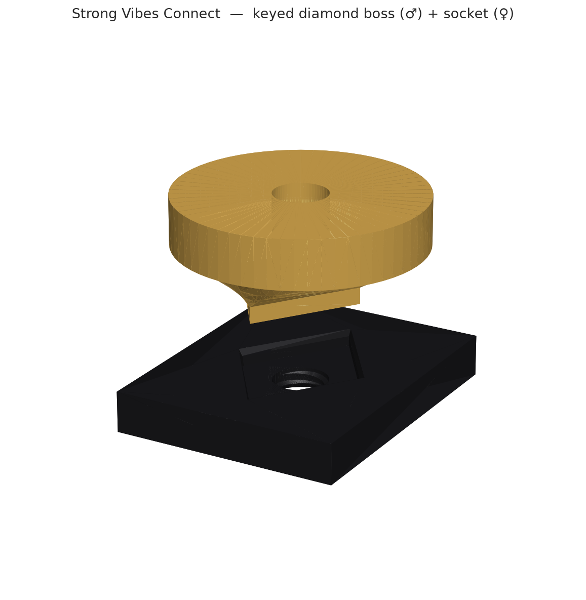

# Strong Vibes Prints

Parametric [build123d](https://build123d.readthedocs.io/) (Python CAD) parts for
mounting a massager, all sharing one mating interface: **Strong Vibes Connect**.
A keyed rhombus/diamond boss (MALE) plugs into a matching diamond socket (FEMALE)
and is clamped by a single 1/4"-20 camera/tripod screw. The interface is defined
exactly once in the `strongvibes` package (`DIA_A`, `DIA_B`, `BAND_DEPTH`) and
every part imports it, so the connection can never drift — any boss plugs into any
socket, forever.

Part of the [**Strong Vibes**](https://github.com/amok-products/strong-vibes)
open builder program by [Europe Magic Wand®](https://europemagicwand.com/strong-vibes-builder).

> **Interactive 3D:** spin every part in your browser at
> **[amok-products.github.io/strong-vibes-prints](https://amok-products.github.io/strong-vibes-prints/)**.



---

## Parts

| Part | Role | Description | Folder |
|------|------|-------------|--------|
| **Holder** | MALE | Snap-fit device holder with a Strong Vibes Connect diamond boss. | [`parts/holder/`](parts/holder/) |
| **Connect** | both | Bench-test set: `strong_vibes_socket_180` + `strong_vibes_socket_30` + a male test boss — print these to validate the interface. | [`parts/connect/`](parts/connect/) |

Everything mates through **Strong Vibes Connect**, so these parts interoperate
with any other part built to the standard.

---

## Print a part

These parts are **parametric source** — you build exactly the fit you want.
Blessed ready-to-print exports land in `parts/<part>/release/` as they're cut; if
a `release/` folder is empty, build from source (below) to generate the files.

1. **Preview first.** Spin any part in the
   [interactive 3D viewer](https://amok-products.github.io/strong-vibes-prints/).
2. **Get an export.** Grab a `.stl` (drop straight into a slicer) or `.step`
   (solid model to re-orient/tweak) from `parts/<part>/release/`, or build one
   (see [Build from source](#build-from-source) and [`EXPORTING.md`](EXPORTING.md)).
3. **Slice it** in **Bambu Studio** or **PrusaSlicer**.
4. **Material** — the holder is for **Europe Magic Wand®** models, tested in Bambu
   Lab **TPU for AMS (68D)** or **PLA Tough**; ordinary PLA will crack. For a perfect
   holder fit, add a **4 cm strip of Bambu Lab non-slip tape** to the lower back.
   Sockets print fine in PLA Tough.
5. **Orientation:** print the holder boss horizontal / device axis vertical, as
   exported.

The joint is assembled with one **1/4"-20 × 9–10 mm** camera/tripod screw (Bambu
Lab). With `FEMALE_THREAD` on, the socket is tapped so the screw stays captive.

---

## The Strong Vibes Connect interface

A keyed **diamond (rhombus) boss** seats flat into a matching **diamond socket**
and is clamped by a **1/4"-20 screw** down the joint axis. The diamond is keyed
(long axis ≠ short axis), so the boss seats in a single orientation (mod 180°).

The standard is the constant cross-section of the diamond, defined once in
`strongvibes/`:

- `DIA_A = 11.322 mm` — long half-diagonal
- `DIA_B = 7.759 mm` — short half-diagonal
- `BAND_DEPTH = 2.0 mm` — the constant-section band the socket grips
- **1/4"-20** thread spec — `THREAD_MAJOR = 6.35`, `THREAD_PITCH = 1.27`

Two socket variants exist:

- **`strong_vibes_socket_180`** — keyed single-orientation pocket (the default).
  One diamond, one way in.
- **`strong_vibes_socket_30`** — a star pocket (the diamond unioned every 30°)
  that accepts the boss every 30° for **stepwise rotational mounting**.

Every part imports these from the `strongvibes` package, so the connection is
inherited, never re-derived. Change the standard in one place and every part
follows. The interface is published as the
[**Strong Vibes Connect** standard](https://github.com/amok-products/strong-vibes/blob/main/connect/strong-vibes-connect.md)
in the umbrella repo.

---

## Build from source

The parts are real Python — open one, change a parameter, and watch the 3D model
update live.

1. **Python + dependencies.** Install **Python 3.13** (the project pins
   `>=3.13,<3.14`), then:

   ```bash
   python3.13 -m venv .venv
   source .venv/bin/activate            # Windows: .venv\Scripts\activate
   pip install -r requirements.txt
   pip install -e .                     # wires up the shared `strongvibes` package
   ```

2. **OCP CAD Viewer.** Install the **OCP CAD Viewer** VS Code extension. It pairs
   with the `ocp_vscode` package (already in `requirements.txt`) and shows the
   live 3D preview on **port 3939**. Viewer settings (autostart, port, dark
   theme, axes, grid) are committed in [`.vscode/settings.json`](.vscode/settings.json).

3. **Run & export.** Open a part's `.py`, Run it, and the live 3D preview updates
   in the OCP CAD Viewer. A plain run previews only; prefix `SV_EXPORT=1` to also
   write `.step`, `.stl`, and `.3mf` to the gitignored **`build/`** working dir
   (via `strongvibes.build_path()`). Slice the result in Bambu Studio /
   PrusaSlicer. See [`EXPORTING.md`](EXPORTING.md) for the full preview/export
   workflow and how release files are blessed.

   ```bash
   python parts/holder/strong_vibes_holder.py               # preview only
   SV_EXPORT=1 python parts/holder/strong_vibes_holder.py   # also write build/
   ```

   > **3MF note:** for threaded parts the `.3mf` write is best-effort —
   > `lib3mf`'s strict manifold check can reject the helical thread mesh even
   > when the solid is valid. Use the **`.stl`** or **`.step`** (slicers re-mesh
   > fine).

### Modify with an AI assistant

The parts are parametric, so natural-language edits work well. A realistic prompt:

> *"In `parts/holder/strong_vibes_holder.py`, make the boss buttress taller for
> strength — set `boss_aspect` to 1.4 — without changing the Strong Vibes Connect
> mating diamond. Then rebuild and confirm it's valid."*

`boss_aspect` (default `1.5`) stretches only the structural flare **behind** the
diamond band; the mating diamond stays the standard `DIA_A` / `DIA_B`, so the
connection never changes.

> **Locked:** the mating diamond (`DIA_A`, `DIA_B`, `BAND_DEPTH`) is the shared
> standard and must **not** change in a single part — that would break
> compatibility with every other part. Changing it is a repo-wide interface event
> (see [`AGENTS.md`](AGENTS.md)).

---

## Repo layout

```
strongvibes/             shared library = the Strong Vibes Connect standard (install: pip install -e .)
parts/holder/            strong_vibes_holder.py — snap-fit device holder, MALE diamond boss
parts/connect/           connect_test.py — bench-test set: strong_vibes_socket_180 + strong_vibes_socket_30 + strong_vibes_boss
  parts/<part>/images/   committed renders
  parts/<part>/release/  committed STL/STEP users download (no build needed)
docs/                    interactive 3D landing page (GitHub Pages) + the .glb models it loads
build/                   gitignored working dir — exports land here while iterating
AGENTS.md                versioning + commit conventions for parts
```

---

## Licensing

- The parametric build123d **source and the models it generates** are licensed
  **[CC-BY-4.0](LICENSE)** — free to use, adapt, and print, including
  commercially, with attribution.
- Third-party dependencies keep their own licenses — see [`ATTRIBUTION.md`](ATTRIBUTION.md).
- The **names** ("Strong Vibes", "Europe Magic Wand®") are governed by
  [`TRADEMARK.md`](TRADEMARK.md).

See [`DISCLAIMER.md`](DISCLAIMER.md) before building or using anything. Versioning
and commit conventions live in [`AGENTS.md`](AGENTS.md).
