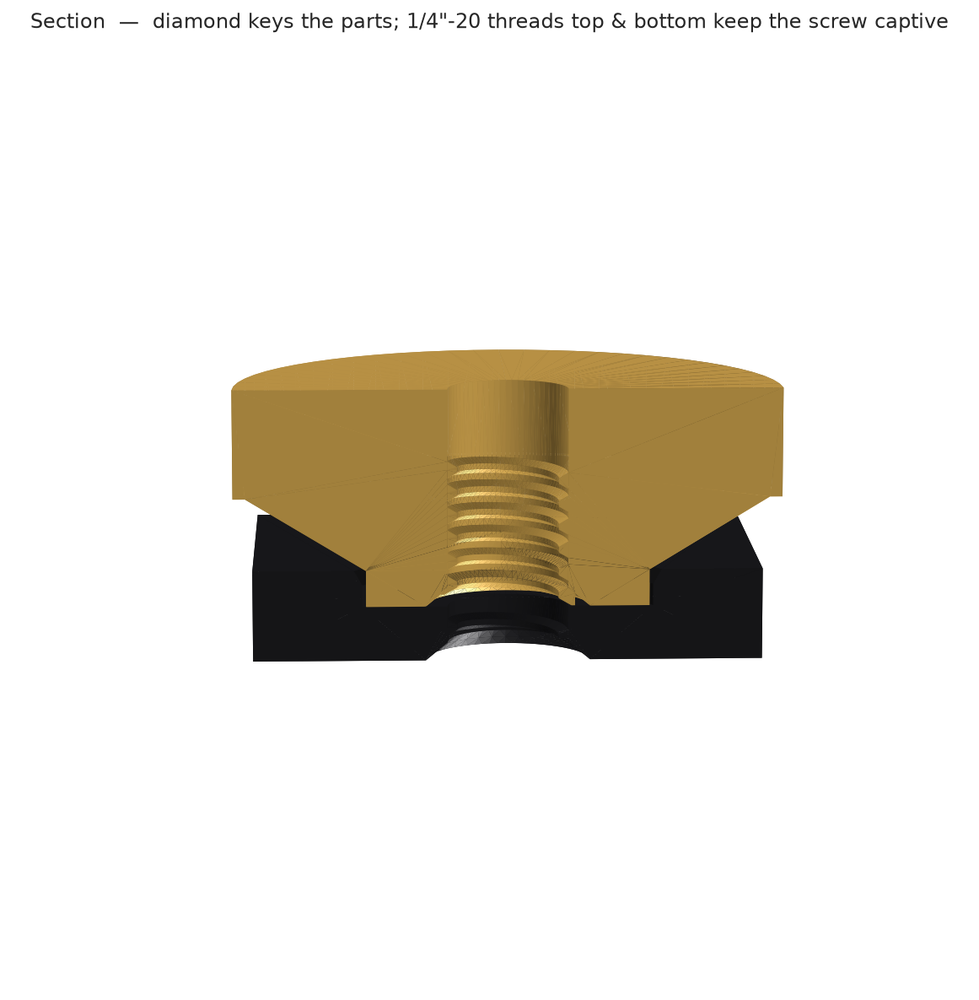
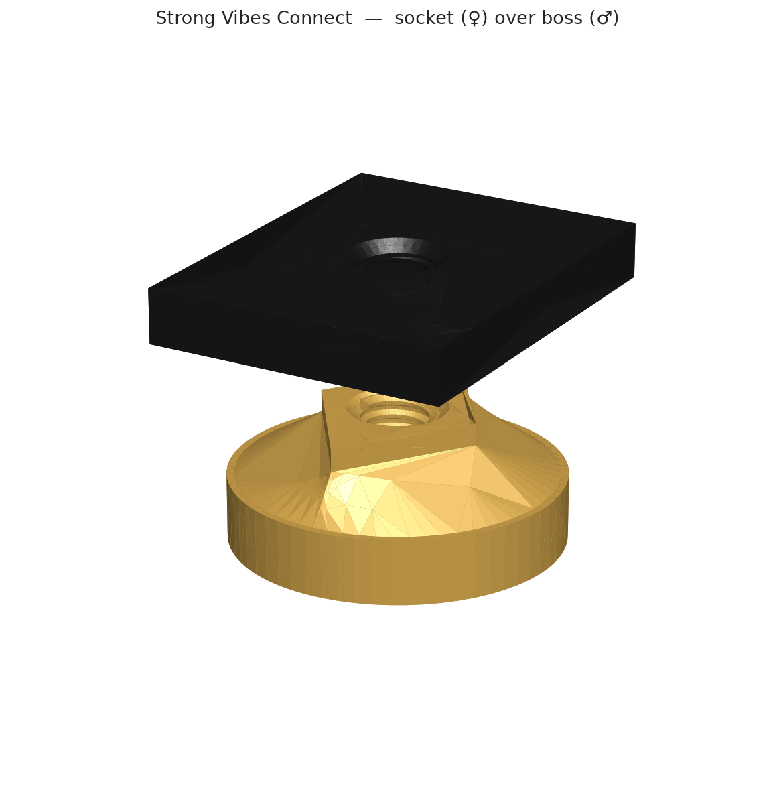
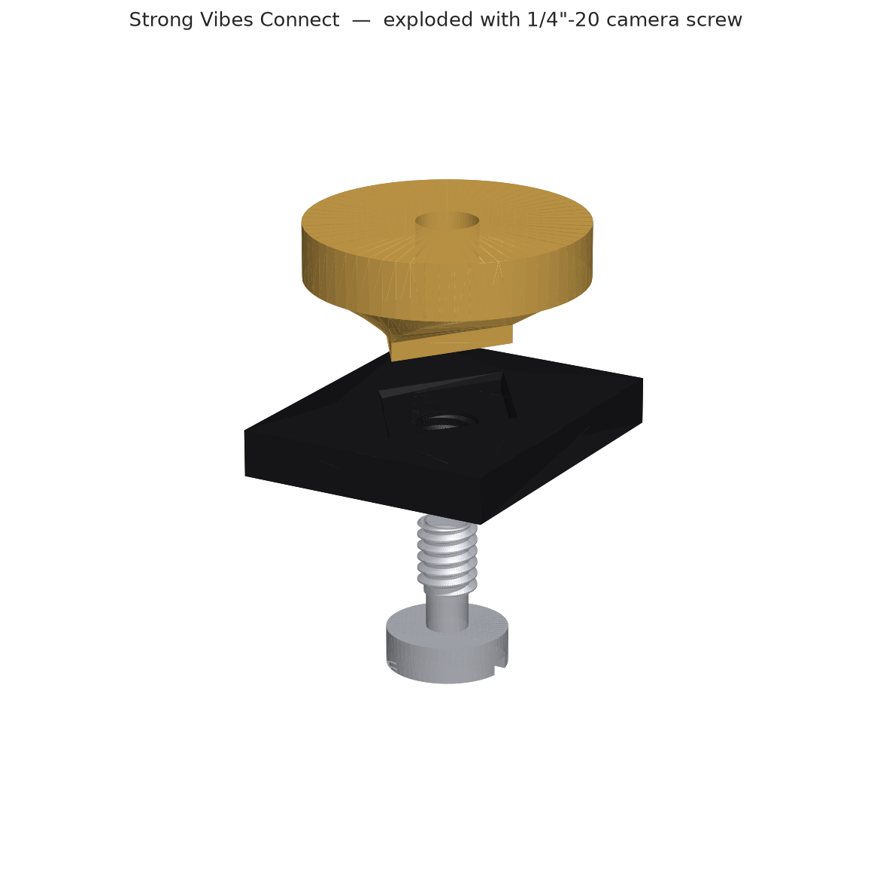

# Connect (`connect_test.py`)

The bench-test pair for the **Strong Vibes Connect** standard — print these to validate the interface itself. It exercises both socket variants against a male test boss, all built from the locked standard in `strongvibes`.


## What's in it

- **`strong_vibes_socket_180`** — FEMALE, keyed diamond pocket: accepts the boss in **one** orientation (mod 180°). The default socket.
- **`strong_vibes_socket_30`** — FEMALE, star pocket (the diamond unioned every 30°): accepts the boss **every 30°** for stepwise rotational mounting.
- **`strong_vibes_boss`** — MALE, a stand-in for the holder boss: the diamond (band + flare) on a round base with a real 1/4"-20 internal thread.

Assemble the pair with one **1/4"-20 × ≥10 mm** screw.

## Key parameters (from `strongvibes/strong_vibes_connect.py`)

| Param | Default | What it does |
|-------|---------|--------------|
| `DIA_A` / `DIA_B` | `11.322` / `7.759` | Long / short diamond half-diagonals [mm] — the locked standard. |
| `BAND_DEPTH` | `2.0` | Constant-section band the socket grips [mm]. |
| `CLEAR` | `0.20` | Fit clearance per half-diagonal (0.12 tight … 0.35 loose). |
| `THREAD_CLEAR` | `0.6` | Diametral clearance on the modelled 1/4-20 thread for FDM. |
| `FEMALE_THREAD` | `True` | Tap the socket so the screw stays captive (else a plain clearance bore). |

## Renders

| | |
|--|--|
|  |  |
|  |  |

## Preview & export

```bash
python parts/connect/connect_test.py    # live 3D in the OCP CAD Viewer (port 3939)
```

Running the module prints an interface summary (the standard `DIA_A` / `DIA_B` / `BAND_DEPTH` and each part's bounding box). Set `EXPORT = True` (the default is `False`, preview-only) to also write `.step` and `.stl` for each part to the gitignored `build/` dir.
